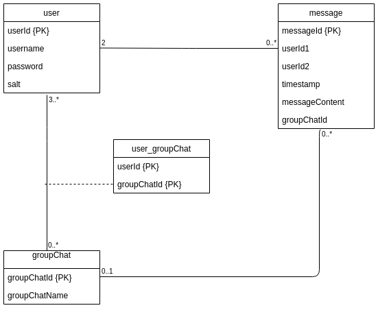

<h1>Chat applikasjon</h1>
Chat applikasjon med RESTful Java backend (JAX-RS).


## Innhold
- [Hvordan kjøre prosjektet lokalt](#hvordan-kjøre-prosjektet-lokalt)
- [JavaDocs](#javadocs)
- [Mappestruktur](#mappestruktur)
- [Endepunkter](#endepunkter)
- [Databasemodell](#databasemodell)
- [Docker og Maven](#docker-og-maven)
- [Informasjon om server](#informasjon-om-server)
- [Informasjon om klient](#informasjon-om-klient)
- [Informasjon om tester](#informasjon-om-tester)
- [Systemet som helhet](#systemet-som-helhet)
- [Porter](#porter)


## Hvordan kjøre prosjektet lokalt
For å kjøre prosjektet lokalt trenger man Maven på maskinen. Først, sjekk om det allerede er installert. Hvis ikke, kan det lastes ned [her](https://maven.apache.org/download.cgi). Pakk ut Maven og les README som følger med for å innstallere Maven.


For at meldingsapplikasjonen skal fungere trenger man en tilkobling til database for lokal kjøring. Drifterne setter opp databaser på VM. 
I filen Database.java må IP til VM legges til i varaiabelen "IP_TO_VM"

Når Maven er installert, og databasetilkobling er satt opp kan prosjektet kjøres med følgende kommando:
```text
mvn jetty:run
```
Her er det vikitg at man står i rot-katalogen når man kjører kommandoen.
Meldingsapplikasjonen er nå tilgjengelig på [http://localhost:8080](http://localhost:8080). Endringer som gjøres i 
prosjektet lokalt blir automatisk oppdatert. For å stoppe kjøring av prosjektet trykk på Ctrl+C.

## JavaDocs
Ved hjelp av Gitlab-CI og Doxygen genereres JavaDocs automatisk hver gang nye endringer blir pushet til master. Deretter
blir det automatisk hostet på Gitlab Pages:

[JavaDocs](http://magnewor.pages.stud.idi.ntnu.no/devops/)


## Mappestruktur
```text
devops/
├── docs/
|   └── Doxyfile
|
├── gatling/
|   ├── chat/
|   |   └── ChatSimulation.scala
|   |   
|   └── usernames.csv
|
├── groupChat/
|   ├── GroupChatDAO.txt
|   ├── GroupChatDAOTest.txt
|   └── GroupChatResourceTest.txt
|
├── sql/
|   └── myChat.sql
|
├── src/
|   ├── main/
|   |   ├── java/
|   |   |   ├── dao/
|   |   |   |   ├── Database.java
|   |   |   |   ├── GroupChatDAO.java
|   |   |   |   ├── MessageDAO.java
|   |   |   |   └── UserDAO.java
|   |   |   | 
|   |   |   ├── data/
|   |   |   |   ├── GroupChat.java
|   |   |   |   ├── Message.java
|   |   |   |   └── User.java
|   |   |   |  
|   |   |   ├── resources/
|   |   |   |   ├── CalculatorResource.java
|   |   |   |   ├── GroupChatResource.java
|   |   |   |   ├── MessageResource.java
|   |   |   |   └── UserResource.java
|   |   |   |   
|   |   |   └── websockets/
|   |   |       └── Websocket.java
|   |   |       
|   |   └── webapp/
|   |       ├── css/
|   |       |   ├── app.css
|   |       |   ├── index.css
|   |       |   ├── popupform.css
|   |       |   └── settings.css
|   |       |
|   |       ├── js/
|   |       |   ├── calculator.js
|   |       |   ├── createElements.js
|   |       |   ├── groupchat.js
|   |       |   ├── index.js
|   |       |   ├── message.js
|   |       |   ├── responsive.js
|   |       |   ├── settings.js
|   |       |   ├── user.js
|   |       |   └── websocket.js
|   |       |
|   |       ├── WEB-INF/
|   |       |   └── web.xml
|   |       |
|   |       ├── app.html
|   |       ├── index.html
|   |       └── settings.html
|   |
|   └── test/
|       └── java/
|           ├── CalculatorResourceTest.java
|           ├── MessageDAOTest.java
|           ├── MessageResourceTest.java
|           ├── UserDAOTest.java
|           └── UserResourceTest.java      
|
├── .gitignore
├── .gitlab-ci.yml
├── database.png
├── Dockerfile
├── Jenkinsfile
├── docker-compose-logging.yaml
├── docker-compose-test.yaml
├── docker-compose.yaml
├── glances.conf
├── installGatling
├── pom.xml
├── README.md
├── runGatling
├── runLogging
└── setupJenkins
```


## Endepunkter
Et endepunkt er definert med en URI, som i praksis er det samme som en URL. Endepunktene gir tilgang til såkalte ressurser, men en ressurs kan i praksis være
hva som helst, så det er ikke så veldig spesifikt.
I vår sammenheng kommer en ressurs til å være et sted vi enten kan hente data ut fra, eller sende data inn til. Alt som trengs for å sende/hente data
er allerede programmert inn i systemet, så vi slipper å tenke på den delen. Det som er viktig for oss, er hvordan en URI er bygd opp, og hvilket HTTP-verb som
brukes i sammenheng med den.

Om en ser på oversikten over endepunkter vi har under, ser en at en del av URIene har klammeparenteser i seg. Disse klammeparentesene betyr at det er en variabel,
og vil erstattes av en konkret verdi. Dette er mulig, fordi alle entitetene (se databasemodellen) får en ID når de opprettes, så disse er allerede tilgjengelige.
Vi kan ta et eksempel:

`GET /user/{userId}` vil bli f.eks. `GET /user/1234`, som vil hente ut all data for brukeren som har fått IDen '1234'.  
`PUT /user/{userId}` vil bli f.eks. `PUT /user/1234`, og denne vil oppdatere data på brukeren med ID '1234'.  

`POST` blir en liten joker i dette tilfellet. Siden `POST` brukes for å opprette ting, og den tingen ikke har fått noen ID ennå (husk, denne IDen er det databasen
selv om lager, ikke noe vi skal sende med), så blir URIen for å opprette en bruker simpelthen:

`POST /user`

Jeg skrev at `POST` brukes for å opprette ting, men dette er en sannhet med modifikasjoner. `POST` brukes også for å sende inn data som serveren trenger for å utføre
oppgaver, selv om den ikke oppretter noe. Kalkulatoren er et godt eksempel på dette, hvor man må sende inn regnestykket man vil ha utført, men som ikke oppretter
noe i databasen.

Data blir sendt i kroppen på HTTP-requesten/responsen, i et format som kalles JSON. Som tidligere nevnt, dette er noe som allerede systemet tar seg av for oss,
slik at vi slipper å tenke på det. Det eneste som kan være viktig i denne sammenhengen, er annotasjonene `@Consumes` og `@Produces` (se segmentet "Informasjon om server").
Disse vil alltid være JSON for vår del, og det finnes eksempler på hvordan man gjør det i koden, noe som kan være greit å huske til man skal implementere egne 
endepunkter, samt hvilket HTTP-verb man skal bruke (dette er stort sett oppgitt i oppgavene).

| Endepunkt                         | Verb  | Hva                                       | Type      |
| ---------                         | ---   | ---                                       | ----      |
| /                                 | GET   | Loginside                                 | HTML-fil  |
| /app.html                         | GET   | Applikasjonside                           | HTML-fil  |
| /settings.html                    | GET   | Innstillingside                           | HTML-fil  |
| /user                             | GET   | Hent alle brukere                         | Data      |
|                                   | POST  | Legge til bruker                          | Data      | 
| /user/{userId}                    | PUT   | Endre bruker                              | Data      |
| /message/{userId1}/{userId2}      | GET   | Hent meldinger mellom to brukere          | Data      |
| /message                          | POST  | Legge til ny melding                      | Data      |
| /groupchat                        | POST  | Legge til ny gruppechat                   | Data      |
| /groupchat/{groupChatId}          | GET   | Hent ut et gruppechat objekt              | Data      |
| /groupchat/{groupChatId}/message  | GET   | Hent ut meldinger til en gruppechat       | Data      |
|                                   | POST  | Legge til ny melding                      | Data      |
| /groupchat/user/{userId}          | GET   | Hent ut alle gruppechatter for en bruker  | Data      |
| /calculator                       | POST  | Send inn regnestykke til kalkulatorbot    | Data      |


## Databasemodell



## Docker og Maven
Dette systemet bruker Maven. Maven er et verktøy som hjelper til å håndtere dependencies i systemet. Ved å bruke Maven 
forsikrer man at alle bruker samme versjon av depencies, og at man lett kan endre de på kun ett sted, dersom det 
endres hva som trengs for å kjøre systemet. I tillegg brukes Maven både til å kompilere systemet og kjøre tester. 
Dependencies deklareres i filen pom.xml. Filen `web.xml` brukes for å sette URLer i den ferdig kompilerte applikasjonen.

Docker er et verktøy som lar oss kjøre forskjellige programmer i egne konteinere for kjøring av systemet. Dette 
er blant annet database, testdatabase, database klient og server som kan kjøre chat applikasjonen. Filene som brukes til dette er 
Dockerfile og docker-compose. Dockerfile er en fil med oppskrift til hvordan en enkelt konteiner skal bygges. Filene 
som starter med `docker-compose` er oppsett av flere konteinere i samme miljø. Her er også en av fordelene at man lett kan
bytte verktøy som brukes, eller versjoner av verktøyene. Ved hjelp av docker kan utviklerene enkelt levere kode og 
dockerfiler til drifterene, som kun trenger å bruke dockerfilene for å kjøre og rulle ut systemet. 


## Informasjon om server
Server består av fire mapper:
- `dao`
- `data`
- `resources`
- `websocket`

DAO står for Data Access Object, og brukes av systemet for å kommunisere med databasen. I `dao`-mappa finner vi også 
klassen `Database`, som er filen som sørger for tilkobling til databasen. Ved hjelp av `dao`-klassene kan vi bruke java-objekter til å kommunisere med databasen.

I mappa `data` finner vi objektklassene som brukes i systemet. Vi har `GroupChat`, `Message` og `User`.

Resources er filene som brukes for kommunikasjon mellom klient og server. Her brukes rammeverket JAX-RS for å lage
webtjenester som er RESTful. I resource filene brukes det følgende annoteringer:
- `@Path`
- `@GET`
- `@POST`
- `@PUT`
- `@Consumes`
- `@Produces`

`@Path` bestemmer hvilke adresse ressursene skal være tilgjengelige  (se segmentet om endepunkter).

`@GET`, `@POST` og `@PUT` setter hvilke HTTP verb metoden svarer på. F.eks., en metode med `@GET` vil ikke svare om det kommer
inn en forespørsel til den samme adressen, dersom klienten bruker HTTP-verbet `POST`. 

`@Consumes` og `@Produces` definerer formatet på data som kommer inn og formatet på data metoden returnerer (JSON, for oss). 

Websocket er nødvendig for å hente inn nye chatmeldinger etterhvert som de skrives. Alternativet til websockets er å 
hele tiden sende forespørsler for å sjekke om det er noen nye meldinger tilgjengelig.


## Informasjon om klient
Klient består av tre forskjellige typer filer:
- HTML
- CSS
- JS

HTML filene er innholdet. CSS filene er utseende og utformingen. JavaScript er filene som bestemmer hvordan de 
forskjellige elementene på siden reagerer på brukerinteraskjon, og brukes også til å endre innholdet på siden. Endringer
kan for eksempel være nye brukere som logger på, som må legges til i brukerlista.


## Informasjon om tester
Til testing brukes testrammeverket JUnit. I tillegg settes det opp en testdatabase med docker, slik at testene kan 
kjøres opp mot denne. Når testene kjøres blir databasen slettet, og opprettet på nytt. Dette forsikrer at resultatet av
testene ikke er avhengig av innholdet på databasen, og at den andre databasen ikke fylles opp av testdata.

Testene kan kjøres lokalt med kommando:
```text
mvn clean test
```
Her er det vikitg at man står i rot-katalogen når man kjører kommandoen.
Dette krever at Maven er innstallert på maskinen. Alternativt kan testene også kjøres i IDE.


## Systemet som helhet
Klient-siden bruker endepunkter for å kommunisere med server. På server peker de forskjellige endepunktene på metoder i 
resource klassene. Resource klassene bruker DAO klassene for å kommunisere med databasen. For å sende data til og motta
data fra databasen bruker DAO klassene objektklasser. For å varsle andre brukere om nye hendelser i sanntid, brukes 
websockets.


## Porter
| Port      | Hva                               |
| ------    | ------                            | 
| 80        | Chat applikasjon                  |
| 3306      | Test database                     |
| 3307      | Database til lokal kjøring        |
| 3308      | Database til lokal testing        |
| 8070      | Adminer (Databaseklient)          |
| 8080      | Jenkins                           |
